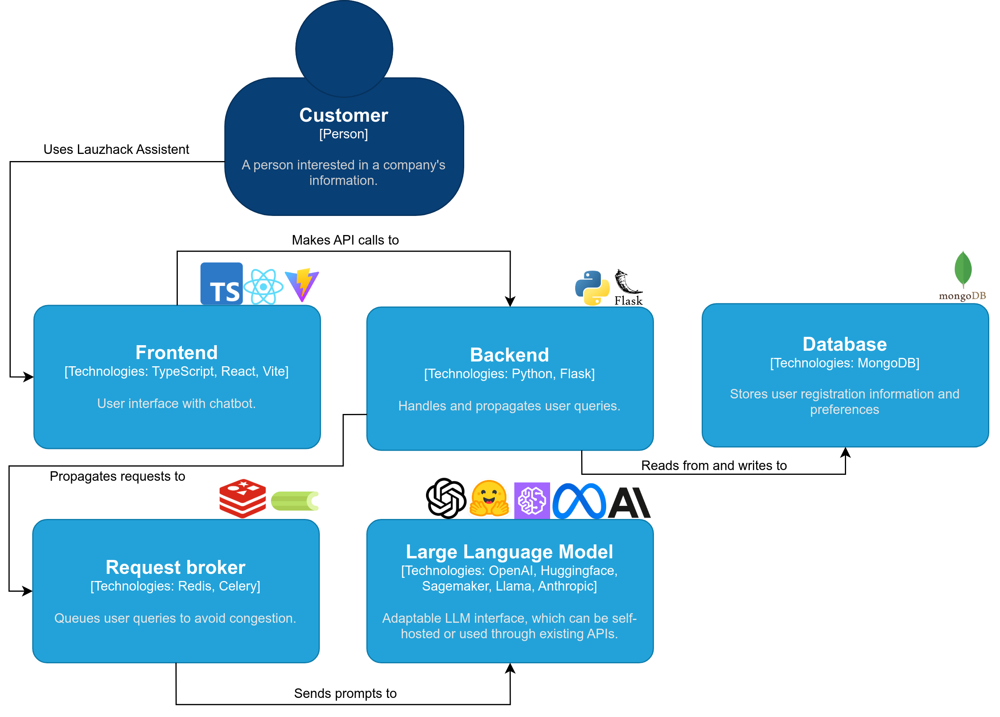

# Lauzcom Assistant

Lauzcom Assistant is an interactive and user-friendly solution designed to provide seamless access to critical Swisscom data. By integrating powerful **GPT** models, customers can easily ask questions about public Swisscom data and receive accurate answers swiftly.

Say goodbye to time-consuming manual searches, and let **Lauzcom Assistant** revolutionise your customer interactions.

## Authors

The Lauzcom Assistant project is created by:

- [Carmen Marcos](https://github.com/carmenmarcos00)
- [Daan Rosendal](https://github.com/daanrosendal)

## Table of contents

- [Architecture](#architecture)
- [Quick start](#quick-start)
- [Development environment](#development-environment)
  - [Run Mongo and Redis](#run-mongo-and-redis)
  - [Run the backend](#run-the-backend)
  - [Run the frontend](#run-the-frontend)
- [License](#license)

## Architecture



## Quick start

> [!Note]
> Make sure you have [Docker](https://docs.docker.com/engine/install/) installed

On macOS or Linux, run:

```bash
./setup.sh
```

It installs all the dependencies and allows you to download a model locally or use OpenAI. LauzHack Assistant now runs at http://localhost:5173.

Otherwise, follow these steps:

1. Download and open this repository with `git clone git@github.com:cern-lauzhack-2023/Lauzcom-Assistant.git`.
2. Create a `.env` file in your root directory and set the env variable `API_KEY` with your [OpenAI API key](https://platform.openai.com/account/api-keys) and `VITE_API_STREAMING` to true or false, depending on whether you want streaming answers or not.

    ```bash
    API_KEY=<YourOpenAIKey>
    VITE_API_STREAMING=true
    ```

    See optional environment variables in the [/.env-template](https://github.com/cern-lauzhack-2023/Lauzcom-Assistant/blob/main/.env-template) and [/application/.env_sample](https://github.com/cern-lauzhack-2023/Lauzcom-Assistant/blob/main/application/.env_sample) files.

3. Run [./run-with-docker-compose.sh](https://github.com/cern-lauzhack-2023/Lauzcom-Assistant/blob/main/run-with-docker-compose.sh).
4. LauzHack Assistant now runs at http://localhost:5173.

To stop, press `Ctrl + C`.

## Development environment

### Run Mongo and Redis

For development, only two containers are used from [docker-compose.yaml](https://github.com/cern-lauzhack-2023/Lauzcom-Assistant/blob/main/docker-compose.yaml) (by deleting all services except for Redis and Mongo). See file [docker-compose-dev.yaml](./docker-compose-dev.yaml).

Run:

```bash
docker compose -f docker-compose-dev.yaml build
docker compose -f docker-compose-dev.yaml up -d
```

### Run the backend

> [!Note]
> Make sure you have Python 3.10 or 3.11 installed.

1. Export required environment variables or prepare a `.env` file in the `/application` folder.
   - Copy [.env_sample](https://github.com/cern-lauzhack-2023/Lauzcom-Assistant/blob/main/application/.env_sample) and create `.env` with your OpenAI API token for the `API_KEY` and `EMBEDDINGS_KEY` fields.

(check out [`application/core/settings.py`](application/core/settings.py) if you want to see more config options.)

2. (optional) Create a Python virtual environment:
   Follow the [Python official documentation](https://docs.python.org/3/tutorial/venv.html) for virtual environments.

   a) On Linux and macOS:

   ```bash
   python -m venv venv
   . venv/bin/activate
   ```

   b) On Windows:

   ```bash
   python -m venv venv
   venv/Scripts/activate
   ```

3. Install dependencies for the backend:

```bash
pip install -r application/requirements.txt
```

4. Run the app using:

```bash
flask --app application/app.py run --host=0.0.0.0 --port=7091
```

The backend API now runs at http://localhost:7091.

5. Start worker with:

```bash
celery -A application.app.celery worker -l INFO
```

### Run the frontend

> [!Note]
> Make sure you have Node version 16 or higher.

1. Navigate to the [/frontend](https://github.com/cern-lauzhack-2023/Lauzcom-Assistant/tree/main/frontend) folder.
2. Install the required packages `husky` and `vite` (ignore if already installed).

```bash
npm install husky -g
npm install vite -g
```

3. Install dependencies by running:

```bash
npm install --include=dev
```

4. Run the app using:

```bash
npm run dev
```

The frontend now runs at http://localhost:5173.

## License

The source code license is [MIT](https://opensource.org/license/mit/), as described in the [LICENSE](LICENSE) file.

Built with [:bird: :link: LangChain](https://github.com/hwchase17/langchain)
